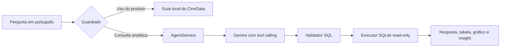
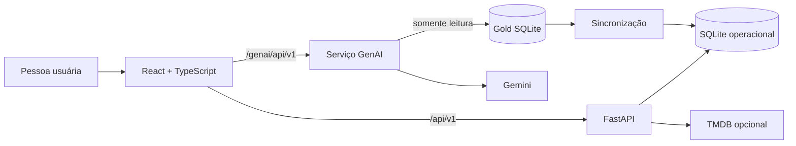

# CineData GenAI

Entrega da atividade de GenAI do Rocket Lab 2026.2. O projeto implementa um
agente analítico em Python que responde perguntas sobre filmes em linguagem
natural usando Gemini, tool calling e a camada Gold SQLite em modo somente
leitura. A plataforma CineData fornece a interface e o contexto de produto para
esse assistente.

## Assistente GenAI

O chatbot é o núcleo desta entrega. Ele recebe uma pergunta em português,
identifica se ela é uma dúvida sobre o CineData ou uma consulta ao catálogo e
retorna uma resposta adequada ao tipo de pedido.



O caminho analítico é composto por:

- `agent.py`: orquestra a pergunta, ferramenta, validação, consulta e resposta;
- `agent_models.py`: contratos dos tool calls e das respostas estruturadas;
- `gemini_adapter.py`: integração configurável com Gemini e fallback;
- `sql_guard.py` e `sql_executor.py`: validação e execução segura do SQL;
- `semantic_search.py`: busca por título e sinopse para perguntas descritivas ou híbridas;
- `insight_service.py`: interpreta resultados numéricos para a interface;
- `evaluation_runner.py`: avalia as perguntas de referência contra o Gold.

O serviço expõe `POST /api/v1/questions` em `http://localhost:8001`. O frontend
chama essa rota por `/genai/api/v1`, sem expor a chave Gemini ao navegador.

## CineData como interface do agente

### Descoberta e comunidade

- busca por título, pessoa ou produtora, filtros básicos e avançados, ordenação
  e paginação com pré-carregamento;
- detalhes de filmes, capas, sinopse, elenco, direção, produtoras e trailer;
- cadastro, login JWT, perfil, avatar, avaliações, listas e filmes para assistir;
- amizades, comunidades, publicações, comentários, reações e moderação;
- mapa de gostos com recomendações por gêneros, elenco, direção, sinopses, ano
  e métricas do catálogo;
- painel administrativo com catálogo, comunidades, analytics e integração TMDB
  opcional.

### Chatbot

O chatbot responde perguntas sobre os recursos do CineData e consultas em
linguagem natural sobre os dados do catálogo. A interface inclui exemplos no
botão **Ajuda**, respostas em texto, tabelas, gráficos e insights.

- explica catálogo, filtros, listas, amigos, comunidades, mapa de gostos e,
  para administradores, analytics;
- responde cumprimentos e perguntas curtas sobre o produto sem chamar o modelo;
- cria gráficos de barras, linhas, rosca e dispersão para respostas numéricas;
- mantém conversas salvas por conta, com criação, retomada, renomeação e exclusão;
- oferece modo temporário, que não persiste mensagens nem aparece no histórico;
- usa cache de respostas e fallback de modelo em falhas temporárias do provedor.

O modelo recebe apenas o resumo semântico necessário da conversa atual. Tokens,
identificadores pessoais e dados da conta não são enviados ao provedor.

### Comportamento da resposta

Para perguntas analíticas, o agente responde somente com o que foi retornado
pela consulta. Quando uma métrica essencial estiver ausente, pede
esclarecimento antes de executar SQL. Resultados tabulares recebem nomes de
colunas voltados ao produto, sem expor chaves técnicas como `sk_movie_id` ou
`sk_person_id`.

Quando houver dados comparáveis, a interface escolhe um gráfico compatível e
mantém a tabela como detalhe consultável. Rankings financeiros, por exemplo,
podem virar barras; séries por ano usam linhas; participações podem usar rosca
e duas medidas de nota podem usar dispersão. O insight é complementar à tabela
e não inventa fatos fora dela.

### Segurança, qualidade e disponibilidade

- perguntas fora do escopo, instruções para ignorar regras e tentativas de
  manipular a consulta são recusadas pelos guardrails;
- o SQL passa por `sqlglot`, aceita somente um `SELECT` e permite apenas o
  schema Gold autorizado;
- o arquivo Gold é aberto com SQLite `mode=ro`; DDL, DML, múltiplas instruções
  e funções de arquivo possuem uma segunda barreira de bloqueio;
- limite de linhas, timeout e limites especiais para joins complexos evitam
  bloquear o serviço;
- resultados válidos permanecem no cache por cinco minutos, separados por
  conversa, contexto, versão do Gold e versão das regras;
- em falhas temporárias de conexão, timeout, cota ou resposta 5xx, o adaptador
  tenta uma vez o modelo de fallback;
- avaliações locais comparam números e dados esperados do Gold, sem exigir
  igualdade textual da consulta SQL gerada.

## Arquitetura



| Camada | Tecnologias |
| --- | --- |
| Interface | React 19, TypeScript, Vite e CSS. |
| API | FastAPI, Pydantic, SQLAlchemy assíncrono e SQLite. |
| Dados | Gold SQLite, Git LFS, Alembic e sincronização transacional. |
| GenAI | FastAPI isolado, SDK Google GenAI, tool calling, `sqlglot` e SQLite read-only. |
| Qualidade | pytest, Ruff, Vitest, Testing Library, oxlint e Docker Compose. |

## Cobertura obrigatória e avaliações locais

O agente transforma perguntas em SQL e valida a consulta antes de executá-la.
Somente uma instrução `SELECT` nas tabelas e colunas autorizadas pode ser
executada. DDL, DML, múltiplas instruções e acesso a arquivos são rejeitados.
As respostas informam métrica, unidade, período, população válida e limitações.

| Grupo | Consultas de referência |
| --- | --- |
| Q01-Q03 - Finanças | Top 10 por receita, lucro médio por gênero e maiores margens. |
| Q04-Q06 - Popularidade e notas | Top 5 populares, divergência TMDB/IMDb e média IMDb anual. |
| Q07-Q09 - Elenco e equipe | Ator com mais filmes, diretores com maior média e dupla ator-diretor. |
| Q10-Q12 - Gêneros e produtoras | Filmes por gênero, lucro por produtora e margem por gênero. |
| Q13-Q14 - Avaliações | Filmes mais avaliados e divergência entre usuários e IMDb. |

Além das consultas estruturadas, a busca híbrida usa títulos e sinopses para
encontrar filmes por descrição e combina esse recorte com SQL quando necessário.

Os cenários de avaliação, resultados esperados e consultas de referência ficam
em [docs/genai/evaluation-cases.md](docs/genai/evaluation-cases.md) e
[docs/genai/reference-queries.sql](docs/genai/reference-queries.sql). Eles
validam os valores retornados e as colunas relevantes, não a forma textual do
SQL produzido pelo modelo.

## Caminhos demonstráveis no chatbot

| Objetivo | Pergunta para testar | Caminho esperado |
| --- | --- | --- |
| Ranking financeiro | `Quais são os 5 filmes com maior receita em BRL?` | Gemini, SQL protegido, tabela, gráfico e insight. |
| Continuação contextual | `E qual foi a maior em 2020?` | Reaproveita a métrica e altera somente o período. |
| Busca híbrida | `Quais filmes têm histórias sobre viagem no tempo e qual teve maior receita?` | Busca sinopse, restringe candidatos e consulta os valores. |
| Ajuda do produto | `Como funcionam as comunidades do CineData?` | Guia local, resposta em texto e sem chamada ao Gemini. |
| Privacidade | Ative **Conversa temporária** e envie uma pergunta. | Responde normalmente sem salvar no histórico. |

## Extras implementados

| Extra | Aplicação no projeto |
| --- | --- |
| Guardrails | Recusa SQL direto, instruções adversariais e pedidos fora de escopo. |
| Gráficos e insights | Escolhe visualização compatível com o resultado e gera até três achados baseados nas linhas retornadas. |
| Memória e histórico | Contexto mínimo para continuidade, conversas privadas persistentes e modo temporário. |
| Fallback e cache | Troca de modelo em falhas temporárias e reutilização segura de respostas por cinco minutos. |
| Avaliação ampliada | Variações das perguntas Q01–Q14, filtros, empates, vazios, ambiguidade e orientações sobre a plataforma. |
| Busca híbrida | Índice local de títulos e sinopses combinado com SQL quando a pergunta também pede uma métrica. |

## Bancos de dados

`data/cinerocket.db` é a fonte Gold analítica distribuída por Git LFS e montada
somente para leitura. O backend aplica migrações e sincroniza o conteúdo para
`data/rocketlab.db`, o banco operacional que preserva contas, listas,
avaliações, comunidades e conversas. Um fingerprint SHA-256 evita sincronizações
desnecessárias.

| Banco | Papel |
| --- | --- |
| `data/cinerocket.db` | Fonte Gold para analytics e GenAI. |
| `data/rocketlab.db` | Banco operacional local do CineData. |
| Volume `genai-gold` | Cópia local para acelerar o serviço GenAI. |

## Estrutura relevante para a entrega

```text
genai/
  app/
    agent.py               Orquestrador da pergunta analítica
    agent_models.py        Contratos de tool calling e resposta
    gemini_adapter.py      Gemini e fallback de modelo
    question_guard.py      Guardrails de pergunta
    sql_guard.py           Validação de SQL permitido
    sql_executor.py        Execução SQLite somente leitura
    semantic_search.py     Busca híbrida por título e sinopse
    insight_service.py     Insights para resultados numéricos
    evaluation_runner.py   Avaliações locais Q01-Q14
  tests/                   Testes do módulo GenAI
docs/genai/                Schema, regras e SQL de referência
frontend/src/components/   Chatbot, tabelas, gráficos e apresentação
backend/app/conversations/ Histórico privado e modo temporário
data/cinerocket.db         Gold SQLite, obtido por Git LFS
docker-compose.yml         Serviços frontend, backend e GenAI
```

## Como executar com Docker Compose

### Pré-requisitos

- Docker Desktop com Docker Compose v2;
- Git e Git LFS somente para clonar e obter o arquivo Gold;
- chave Gemini apenas para perguntas analíticas.

O Git LFS é necessário uma única vez porque o banco Gold tem cerca de 722 MB e
é montado pelo host como arquivo somente leitura. Depois do clone, baixe o
banco antes de iniciar o Compose:

```powershell
git lfs install
git clone https://github.com/GuilhermeRangel1/CineData-GenAi.git
cd CineData-GenAi
git lfs pull
```

O download precisa ocorrer fora do contêiner porque a imagem não recebe a
pasta `.git` nem as credenciais Git da pessoa que clonou o repositório.

O Compose usa `pull_policy: build`, construindo as imagens locais antes da
subida. Ele prepara o banco operacional, aplica as migrações, sincroniza o
catálogo e inicia o GenAI automaticamente. Na primeira execução, essa etapa
pode levar alguns minutos. Para executar em segundo plano:

```powershell
docker compose up -d
```

| Serviço | Endereço |
| --- | --- |
| CineData | http://localhost:8080 |
| API CineData | http://localhost:8000 |
| OpenAPI | http://localhost:8000/docs |
| GenAI | http://localhost:8001 |
| Saúde GenAI | http://localhost:8001/health |

Conta de demonstração local:

```text
E-mail: admin@admin.com
Senha: admin123
```

Essas credenciais são apenas para desenvolvimento local. Antes de expor o
projeto a uma rede, troque `JWT_SECRET_KEY` e as credenciais iniciais.

Para encerrar mantendo os dados, use `Ctrl+C` ou `docker compose down`. Para
recomeçar o banco operacional, remova `data/rocketlab.db`; não remova o Gold.

### Modelos Gemini

Não é preciso criar `genai/.env` para iniciar a plataforma. Sem chave, o
chatbot continua respondendo dúvidas sobre o CineData, enquanto perguntas
analíticas informam que o provedor precisa ser configurado.

Para habilitar o Gemini, copie o arquivo de exemplo e preencha a chave:

```powershell
Copy-Item genai/.env.example genai/.env
```

`genai/.env` aceita modelo principal e fallback:

```dotenv
GENAI_GEMINI_API_KEY=sua_chave
GENAI_GEMINI_MODEL=gemini-3.5-flash-lite
GENAI_GEMINI_FALLBACK_MODEL=gemini-3.5-flash
```

Sem a chave, catálogo e recursos sociais continuam disponíveis. Perguntas sobre
o uso do CineData recebem ajuda local; perguntas analíticas retornam erro de
configuração do provedor.

## Execução sem Docker

É necessário Python 3.11+ e Node.js compatível com Vite. Primeiro, execute
`git lfs pull`.

```powershell
# Backend
Copy-Item backend/.env.example backend/.env
Set-Location backend
py -3.11 -m venv .venv
.\.venv\Scripts\python -m pip install -e ".[dev]"
.\.venv\Scripts\alembic upgrade head
.\.venv\Scripts\python -m app.db.gold_seed --database-url "sqlite+aiosqlite:///./rocketlab.db"
.\.venv\Scripts\uvicorn app.main:app --reload
```

```powershell
# GenAI, em outro terminal
Copy-Item genai/.env.example genai/.env
Set-Location genai
python -m pip install -e ".[dev]"
python -m uvicorn app.main:app --reload --port 8001
```

```powershell
# Frontend, em outro terminal
Copy-Item frontend/.env.example frontend/.env
Set-Location frontend
npm ci
npm run dev
```

O frontend de desenvolvimento abre em `http://localhost:5173` e usa o proxy do
Vite para encaminhar o GenAI local.

## Configuração

| Variável | Serviço | Finalidade |
| --- | --- | --- |
| `GENAI_GEMINI_API_KEY` | GenAI | Chave do Gemini. |
| `GENAI_GEMINI_MODEL` | GenAI | Modelo principal. |
| `GENAI_GEMINI_FALLBACK_MODEL` | GenAI | Modelo para falha temporária. |
| `DATABASE_URL` | Backend | URL do banco operacional. |
| `GOLD_DATABASE_PATH` | Backend | Localização do Gold para sincronização. |
| `JWT_SECRET_KEY` | Backend | Assinatura da sessão. |
| `INITIAL_ADMIN_*` | Backend | Conta administrativa inicial. |
| `TMDB_API_TOKEN` | Backend | Integração administrativa TMDB. |
| `VITE_API_BASE_URL` | Frontend | Endereço da API. |
| `VITE_GENAI_API_BASE_URL` | Frontend | Endereço do GenAI. |

## Testes

Os testes do agente usam clientes simulados e não consomem cota Gemini.

```powershell
Set-Location backend
.\.venv\Scripts\python -m pytest
.\.venv\Scripts\ruff check .
```

```powershell
Set-Location genai
python -m pytest
```

```powershell
Set-Location frontend
npm ci
npm run test
npm run lint
npm run build
```

## Documentação complementar

- [Plano de execução](docs/.ruler/TODO.md)
- [Banco de dados e sincronização Gold](docs/database.md)
- [Guia de backend](docs/backend.md)
- [Interface](docs/frontend.md)
- [Esquema permitido pelo agente](docs/genai/gold-schema.md)
- [Regras de métricas](docs/genai/metric-rules.md)
- [Consultas SQL de referência](docs/genai/reference-queries.sql)
- [Casos de avaliação Q01–Q14](docs/genai/evaluation-cases.md)
- [Detalhes do módulo GenAI](genai/README.md)

## Limitações conhecidas

- SQLite e execução local atendem à demonstração; produção concorrente exige
  banco servidor e infraestrutura dedicada.
- A qualidade das respostas analíticas depende do Gemini e dos dados Gold.
- O cache de respostas é temporário e fica na memória do serviço GenAI.
- O mapa de gostos usa o catálogo local e não recomenda filmes fora da base.
- Imagens, trailers e TMDB dependem dos serviços de origem e da conexão.
