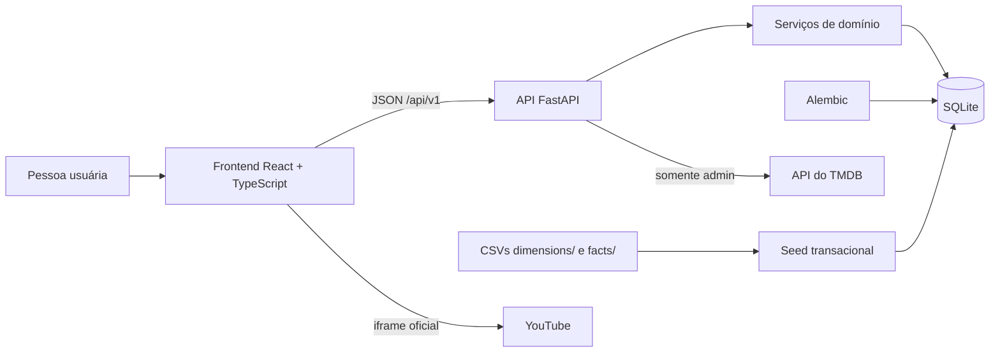

# CineData

Plataforma full-stack de descoberta, avaliação e conversa sobre filmes,
desenvolvida para a atividade DEV do Visagio Rocket Lab 2026.2. O CineData
combina um catálogo cinematográfico com recursos sociais e ferramentas de
análise para quem administra a plataforma.

O projeto é uma aplicação de demonstração executada localmente. Os dados são
armazenados em SQLite e os serviços podem ser iniciados juntos com Docker
Compose. Catálogo, avaliações e áreas sociais usam dados locais; TMDB e YouTube
são integrações opcionais.

## Navegação rápida

| Guia | O que você encontra |
| --- | --- |
| [Como executar](#como-executar) | Inicialização com Docker Compose ou execução local, credenciais de demonstração e configuração. |
| [Frontend](docs/frontend.md) | Telas, fluxos da interface, responsividade e comportamento de mídia. |
| [Backend](docs/api-v1.md) | Rotas, parâmetros, autenticação, formatos de resposta e erros. |
| [Banco de dados](docs/backend.md) | Tabelas, relações, regras de integridade, migrations e carga dos CSVs. |


## Funcionalidades

O CineData acompanha uma jornada cinéfila: descobrir filmes, registrar opiniões,
organizar uma coleção pessoal e conversar com outras pessoas. As histórias
abaixo descrevem o objetivo de cada área e o comportamento implementado.

### Histórias obrigatórias da atividade

| História | Implementação |
| --- | --- |
| Cadastrar filmes com título, direção, ano, gênero e sinopse. | Formulário administrativo de filmes. |
| Navegar e pesquisar filmes no catálogo paginado. | Catálogo local com busca e filtros. |
| Consultar detalhes e o histórico de notas e resenhas. | Página de detalhes do filme. |
| Atualizar ou remover filmes individualmente. | Ações disponíveis para `admin`. |
| Registrar uma avaliação com nota e resenha e consultar a média do filme. | Avaliações autenticadas; a aplicação usa escala de 0 a 10. |

### Descoberta e catálogo

**História:** como visitante, quero encontrar filmes e conhecer seus detalhes
para decidir o que assistir.

O catálogo local pode ser pesquisado por título e filtrado por gênero, pessoa,
produtora, ano, duração e nota externa. Também oferece ordenação e paginação. A
página inicial destaca coleções de filmes; os detalhes reúnem sinopse, equipe,
produtoras, métricas, avaliações e trailer quando disponível. Se a busca local
não localizar o título, a integração opcional com TMDB pode ajudar a resolver
variações do título em português e inglês sem duplicar o registro local.

### Contas e avaliações

**História:** como pessoa autenticada, quero registrar e controlar minha opinião
sobre cada filme.

O cadastro público cria uma conta `user`; o login abre uma sessão Bearer. Cada
conta pode manter uma avaliação por filme, com nota decimal de `0` a `10`,
comentário e visibilidade pública ou privada. A pessoa pode editar ou apagar a
própria avaliação. Avaliações importadas do conjunto de dados ficam separadas
das avaliações feitas pelas contas.

### Coleções pessoais e perfis

**História:** como pessoa autenticada, quero organizar os filmes que acompanho e
decidir o que compartilho no meu perfil.

É possível criar listas com nome e visibilidade pública ou privada, adicionar e
remover filmes e manter uma lista especial de “assistir depois”. Os filmes
avaliados também aparecem numa coleção automática. A própria conta pode editar
nome e avatar e consultar dados privados; outras pessoas veem apenas as partes
públicas do perfil, como avaliações públicas, listas públicas e comunidades. Em
um perfil público, clicar no nome de uma lista abre a coleção completa; a página
do perfil mantém uma prévia de até seis filmes.

### Amizades e comunidades

**História:** como pessoa autenticada, quero encontrar outras pessoas e trocar
ideias sobre cinema em espaços compartilhados.

Amizades começam com pesquisa de pessoas e pedidos que o destinatário pode
aceitar ou recusar; conexões aceitas podem ser removidas. Nas comunidades, a
pessoa entra para publicar, comentar, mencionar filmes e reagir com 🔥, ❤️, 🍿 ou
👎. A aba Amigos mostra pedidos recebidos, busca e conexões; pedidos enviados
continuam registrados e acessíveis pela API, mas não aparecem nessa aba.
Administradores criam e mantêm as comunidades. Ao moderar uma publicação ou
comentário, o texto é removido e substituído por um aviso, preservando o contexto
da conversa. Enquanto uma conversa está aberta, novas mensagens são carregadas
por polling.

### Mapa de gostos

**História:** como pessoa autenticada, quero descobrir filmes próximos aos que
avaliei e entender por que foram sugeridos.

Os filmes avaliados pela conta são as origens do grafo. Para cada origem, o
backend busca candidatos do catálogo que compartilhem gêneros, pessoas ou termos
da sinopse; o SQLite FTS5 ajuda na busca textual. Em seguida calcula uma
afinidade combinando gêneros (34%), direção (18%), elenco (10%), termos da
sinopse (18%), proximidade de ano (8%) e métricas externas (12%). A nota dada
pela pessoa ajusta a força da afinidade: notas altas dão mais peso, notas baixas
reduzem o peso, mas não funcionam como uma rejeição absoluta. Cada aresta liga
um filme avaliado a uma sugestão e inclui sinais legíveis, como gênero, direção
ou tema em comum.

O mapa usa similaridade de conteúdo do catálogo local; não é um modelo treinado,
não aprende com outras contas e não sugere filmes que não estejam na base. A
posição visual dos nós serve para organizar o grafo, não representa uma
coordenada ou distância estatística. Sem avaliações próprias, o mapa mostra como
começar a alimentá-lo.

### Ferramentas administrativas e analytics

**História:** como administrador, quero manter o catálogo e os espaços da
comunidade e acompanhar a atividade real da plataforma.

O administrador pode cadastrar, editar e remover filmes e comunidades, moderar
conteúdo e abrir o painel de analytics. O formulário de filmes pode pesquisar
no TMDB e importar metadados, imagens e trailer; essa integração é opcional e a
chave permanece no backend. Analytics agrega dados existentes, com período
configurável de 1 a 90 dias. O catálogo inicial não inventa avaliações ou
atividade social, então os gráficos sociais começam com poucos dados.

Os estados de carregamento e erro, a responsividade e os comportamentos de mídia
estão detalhados em [docs/frontend.md](docs/frontend.md).

## Perfis de acesso

| Ação | Visitante | `user` | `admin` |
| --- | :---: | :---: | :---: |
| Consultar catálogo, detalhes, trailers e perfis públicos | ✓ | ✓ | ✓ |
| Criar conta e iniciar sessão | ✓ | ✓ | ✓ |
| Avaliar filmes, criar listas e participar socialmente | — | ✓ | ✓ |
| Editar o próprio perfil e ver seus dados privados | — | ✓ | ✓ |
| Criar, editar e remover filmes do catálogo | — | — | ✓ |
| Criar e administrar comunidades | — | — | ✓ |
| Consultar analytics e usar a importação administrativa do TMDB | — | — | ✓ |

O cadastro público sempre cria uma conta `user`. A promoção a `admin` é feita
por configuração e bootstrap; não existe opção de se tornar administrador pelo
formulário de cadastro.

## Arquitetura



### Tecnologias

| Camada | Tecnologias e responsabilidades |
| --- | --- |
| Interface | React 19, TypeScript, Vite e CSS; componentes por área do produto. |
| Cliente HTTP | `fetch`, tipos TypeScript para contratos, cache de leitura, sessão Bearer e invalidação após alterações. |
| API | Python 3.11+, FastAPI, Pydantic e Uvicorn; routers versionados sob `/api/v1`. |
| Domínio e persistência | SQLAlchemy assíncrono, SQLite com `aiosqlite`, serviços por domínio e relações explícitas. |
| Schema e carga | Alembic para migrações; comando de seed separado e transacional para os CSVs. |
| Integração externa | Cliente TMDB no backend; trailers de vídeo reproduzidos pelo iframe oficial do YouTube. |
| Testes e qualidade | pytest e Ruff no backend; Vitest, Testing Library e oxlint no frontend. |
| Execução local | Docker Compose com serviços de backend e frontend e volume nomeado para o banco. |

### Organização do repositório

```text
backend/
  app/
    analytics/       Agregações e schemas do painel administrativo
    api/v1/          Rotas HTTP versionadas
    communities/     Modelos, regras e schemas das comunidades
    core/            Configuração, logging e erros públicos
    db/              Sessão, importador CSV e tarefas de dados
    integrations/    Cliente para a API TMDB
    movies/          Catálogo, avaliações e modelos relacionais
    taste_map/       Cálculo do mapa de gostos e similaridade entre filmes
    users/           Contas, segurança, perfis, listas e amizades
  migrations/        Histórico Alembic do schema
  tests/             Testes de API, domínio, segurança e carga
frontend/
  src/
    api/             Cliente HTTP e tipos de integração
    auth/            Persistência da sessão no navegador
    components/      Catálogo, formulários, listas e áreas sociais
    pages/           Telas principais
    hooks/           Carregamento de recursos e mutações
    lib/             Conversões e utilitários de interface
data/raw/
  dimensions/        CSVs de dimensões do catálogo
  facts/             CSVs de métricas, avaliações e relações
docs/
  images/           Capturas de tela da aplicação
  api-v1.md          Contratos e regras da API
  backend.md         Modelo de dados, migrações e carga do catálogo
  frontend.md        Comportamentos detalhados da interface e mídia
docker-compose.yml   Execução local dos dois serviços
```

## Backend e API

A API FastAPI separa rotas HTTP, regras de domínio e persistência. A lista
completa de endpoints, parâmetros, respostas e permissões está em
[docs/api-v1.md](docs/api-v1.md). A documentação interativa fica em
`http://localhost:8000/docs`. A rota interna da sessão de demonstração
(`POST /api/v1/auth/sessao-teste`) existe somente no Compose e fica fora da
OpenAPI.

### Regras de integridade e segurança

- Senhas nunca são armazenadas em texto puro; o backend usa hash Argon2.
- O login devolve um JWT Bearer. O frontend guarda a sessão no armazenamento
  local do navegador e envia o token nas requisições autenticadas.
- A API verifica autenticação, propriedade dos recursos e papel administrativo
  no servidor; esconder um botão no frontend não substitui a autorização.
- Uma restrição única parcial no banco impede mais de uma avaliação por conta
  e filme, inclusive quando duas escritas chegam simultaneamente. Avaliações
  importadas, sem conta associada, não são limitadas por essa regra.
- Migrações Alembic são a única autoridade para criar e evoluir o schema. O
  importador não cria tabelas e falha se o banco ainda não estiver migrado.
- CORS permite somente as origens configuradas. A configuração padrão local é
  `http://localhost:5173`; o Compose também permite `http://localhost:8080`.
- O token do TMDB permanece no backend e não é retornado ao navegador.

## Dados e persistência

O catálogo local é carregado de CSVs versionados por uma seed transacional. O
schema evolui por migrações Alembic; o backend usa SQLAlchemy assíncrono e SQLite.
A carga inicial inclui cerca de 95 mil filmes e não depende de acesso à internet.

O [guia de backend](docs/backend.md) detalha o modelo relacional, as regras de
integridade, o histórico completo das migrações, a importação dos CSVs e o
comportamento de desempenho do mapa de gostos. O rodapé da aplicação atribui os
dados do TMDB; consulte os [termos da API](https://www.themoviedb.org/api-terms-of-use).

## Como executar

### Opção recomendada: Docker Compose

1. Instale e inicie o Docker Desktop, usando o modo de containers Linux.
2. A configuração Compose já prepara a conta de demonstração `admin@admin.com`,
   com senha `admin123` e nome de perfil `admin`. As portas ficam acessíveis
   somente no próprio computador (`localhost`). Esses valores são exclusivos
   para demonstração local; não os use em uma instalação exposta à rede ou à
   internet. Para trocar as credenciais da demo, altere `INITIAL_ADMIN_EMAIL`,
   `INITIAL_ADMIN_NAME` e `INITIAL_ADMIN_PASSWORD` no `docker-compose.yml`.
   Configure um `JWT_SECRET_KEY` próprio no `.env` da raiz antes de expor o
   serviço a qualquer rede. No modo demo, o frontend inicia automaticamente
   autenticado como essa conta `admin` se não houver uma sessão salva; uma
   sessão existente de usuário comum é preservada.
3. Execute na raiz:

```powershell
docker compose up --build
```

Não é necessário criar ou editar arquivos para iniciar a demonstração. O
catálogo local funciona sem credenciais externas. A busca e a importação de
dados pelo TMDB, disponíveis no formulário administrativo de filmes, exigem um
token próprio: sem ele, a API responde que a fonte externa está indisponível.
Para habilitar essa função, obtenha um token nas
[configurações de API do TMDB](https://www.themoviedb.org/settings/api), copie o
modelo e preencha o token antes de iniciar o Compose:

```powershell
Copy-Item backend\.env.example backend\.env
notepad backend\.env
```

Defina `TMDB_API_TOKEN` para habilitar busca/importação pelo TMDB. Para usar o
chatbot, crie uma chave no [Google AI Studio](https://aistudio.google.com/apikey)
e defina `GEMINI_API_KEY` no mesmo arquivo. O assistente usa Gemini 3.8 Flash
por padrão e exige uma sessão ativa. O Docker Compose carrega essas variáveis ao
iniciar o backend; depois de configurá-las, recrie os serviços com
`docker compose up --build`. O arquivo `.env` fica apenas no seu computador e
não é enviado ao GitHub. Cada pessoa que clonar o projeto precisa configurar
suas próprias chaves para usar essas integrações.

Na primeira execução, o backend constrói o schema, aplica as migrações e carrega
os CSVs antes de ficar saudável; com esse catálogo, a preparação inicial pode
levar alguns minutos. O Compose cria ou sincroniza a conta de demonstração
descrita acima.

Em reinicializações, o bootstrap sincroniza o nome e a senha da conta admin
configurada no Compose; isso garante que as credenciais de demonstração
continuem funcionando com o volume de banco já existente.

| Serviço | Endereço |
| --- | --- |
| Aplicação web | `http://localhost:8080` |
| API | `http://localhost:8000` |
| Documentação OpenAPI | `http://localhost:8000/docs` |
| Health check | `http://localhost:8000/health` |

Para encerrar sem apagar os dados, use `Ctrl+C` ou `docker compose down`. Para
apagar também o banco local do Compose, use `docker compose down -v`; isso é
irreversível para aquele volume, então faça-o somente se realmente quiser
recomeçar a carga do zero.

### Execução local sem Docker

É necessário Python 3.11 ou superior e Node.js compatível com Vite 8 (Node 22 é
usado pela imagem Docker).

#### Backend

No PowerShell, a partir da raiz:

```powershell
Copy-Item backend\.env.example backend\.env
Set-Location backend
py -3.11 -m venv .venv
.\.venv\Scripts\python -m pip install -e ".[dev]"
```

Edite `backend/.env` para definir pelo menos uma `JWT_SECRET_KEY` segura. Para
criar o primeiro administrador, informe também `INITIAL_ADMIN_EMAIL`,
`INITIAL_ADMIN_NAME` e `INITIAL_ADMIN_PASSWORD`. Para usar a busca e a
importação de filmes pelo TMDB, obtenha um token nas
[configurações de API do TMDB](https://www.themoviedb.org/settings/api) e defina
`TMDB_API_TOKEN` no mesmo arquivo. Sem esse token, o catálogo local continua
disponível, mas a integração TMDB não funciona. Depois, ainda em `backend/`:

```powershell
.\.venv\Scripts\alembic upgrade head
.\.venv\Scripts\python -m app.db.seed --database-url "sqlite+aiosqlite:///./rocketlab.db"
.\.venv\Scripts\uvicorn app.main:app --reload
```

A API ficará em `http://localhost:8000`. Para preparar o administrador após as
migrações, se as variáveis estiverem configuradas, execute em outro terminal:

```powershell
Set-Location backend
.\.venv\Scripts\python -m app.users.bootstrap_admin
```

O bootstrap é seguro para repetir com o mesmo e-mail: não cria uma segunda
conta. Não há credenciais padrão embutidas no código.

#### Frontend

Em outro terminal PowerShell, a partir da raiz:

```powershell
Copy-Item frontend\.env.example frontend\.env
Set-Location frontend
npm install
npm run dev
```

O frontend ficará em `http://localhost:5173`. A variável
`VITE_API_BASE_URL` pode apontar para outro endereço da API; por padrão usa
`http://localhost:8000/api/v1`.

## Configuração e credenciais

| Variável | Onde é usada | Finalidade |
| --- | --- | --- |
| `DATABASE_URL` | Backend | URL do banco; localmente usa SQLite em `backend/rocketlab.db`. |
| `BACKEND_CORS_ORIGINS` | Backend | Lista de origens permitidas pelo CORS. |
| `JWT_SECRET_KEY` | Backend e configuração raiz do Compose | Assinatura dos tokens de sessão; use um segredo aleatório e exclusivo. |
| `JWT_ACCESS_TOKEN_EXPIRE_MINUTES` | Backend | Duração da sessão JWT. |
| `INITIAL_ADMIN_EMAIL` | Backend e configuração raiz do Compose | E-mail da primeira conta administrativa. |
| `INITIAL_ADMIN_NAME` | Backend e configuração raiz do Compose | Nome da conta administrativa inicial. |
| `INITIAL_ADMIN_PASSWORD` | Backend e configuração raiz do Compose | Senha inicial; mantenha-a fora do repositório. |
| `TMDB_API_TOKEN` | `backend/.env` | Token necessário para a busca e importação de filmes pelo TMDB. |
| `GEMINI_API_KEY` | `backend/.env` | Chave privada usada pelo backend para conversar com o Gemini. |
| `GEMINI_MODEL` | `backend/.env` | Modelo Gemini Flash; padrão `gemini-3.8-flash`. |
| `VITE_API_BASE_URL` | `frontend/.env` | Endereço-base da API usado pelo Vite no desenvolvimento. |

Os arquivos `.env` contêm segredos e não devem ser commitados. Os arquivos
`.env.example` são modelos sem credenciais reais.

## Testes e verificações

### Backend

```powershell
Set-Location backend
.\.venv\Scripts\python -m pytest
.\.venv\Scripts\ruff check .
```

Os testes do backend cobrem inicialização e configuração, cadastro e login,
permissões administrativas, catálogo e filtros, validação de avaliações,
listas, amizades, perfis, comunidades, analytics, mapa de gostos, integração
com TMDB, segurança de usuários e importação dos CSVs.

### Frontend

```powershell
Set-Location frontend
npm run lint
npm run test
npm run build
```

Vitest e Testing Library cobrem a interação dos componentes com estados de
sucesso, carregamento, erro e formulários, incluindo catálogo, avaliação,
autenticação, listas, perfis, amizades, comunidades, analytics e mapa de gostos.

Na revisão de 26 de setembro de 2026, passaram 77 testes do backend e 54 do
frontend; Ruff, lint e build do frontend também passaram. Migrações, seed em
banco limpo e smoke test com Docker Compose foram verificados no mesmo
checkpoint. O lint mantém um aviso já existente em `MovieDetail.tsx` sobre
atualização de estado dentro de efeito. Os números são um retrato dessa
execução: podem mudar quando novos testes forem adicionados.

## Limitações conhecidas

- SQLite e um único processo são apropriados à demonstração local; implantação
  concorrente de maior escala exigiria banco servidor, estratégia de arquivos e
  infraestrutura de execução adequada.
- Conversas de comunidades usam polling a cada cinco segundos enquanto estão
  abertas e visíveis. Não há WebSocket nem paginação do histórico completo.
- A métrica “mais vistas” conta aberturas da conversa e reaberturas, não pessoas
  únicas; ela pode ser manipulada e começa a acumular após a migração de views.
- A busca textual do catálogo local é pelo título e não é fuzzy. A pesquisa do
  TMDB é uma integração administrativa separada.
- Os gráficos refletem a atividade gravada no banco. Dados iniciais do catálogo
  não criam usuários, listas ou atividade social histórica artificial.
- O mapa faz similaridade de conteúdo sobre o catálogo local e uma shortlist de
  candidatos; não treina um modelo nem conhece filmes que não estejam na base.
- Imagens, fontes e vídeos externos dependem da disponibilidade do serviço de
  origem, da conexão e das políticas do navegador.
