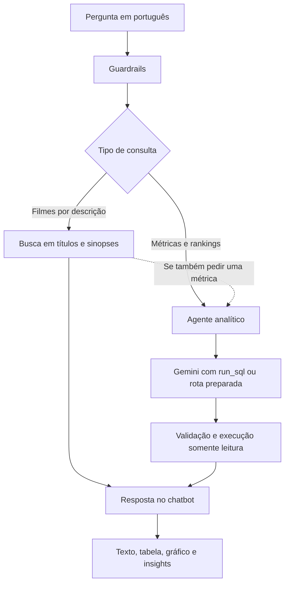
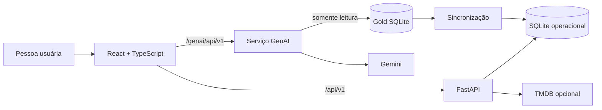
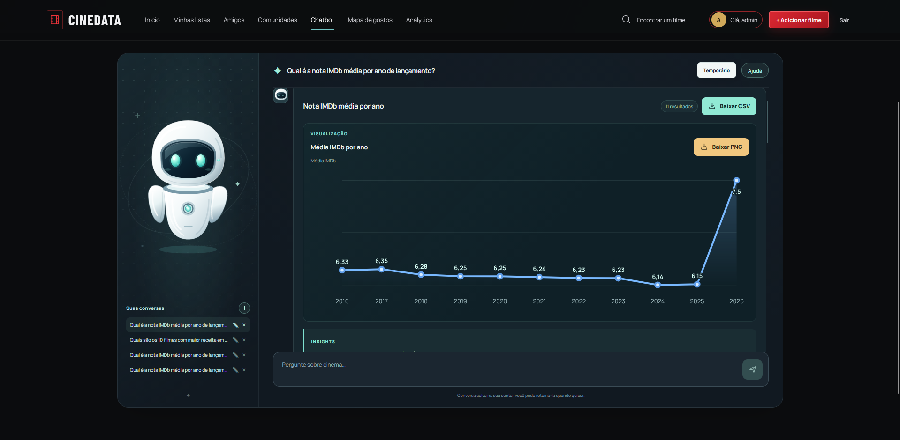
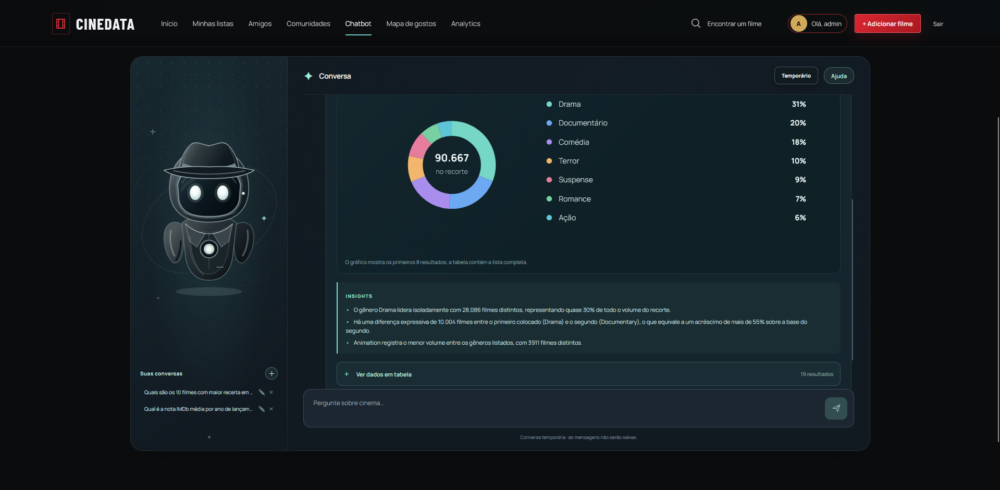
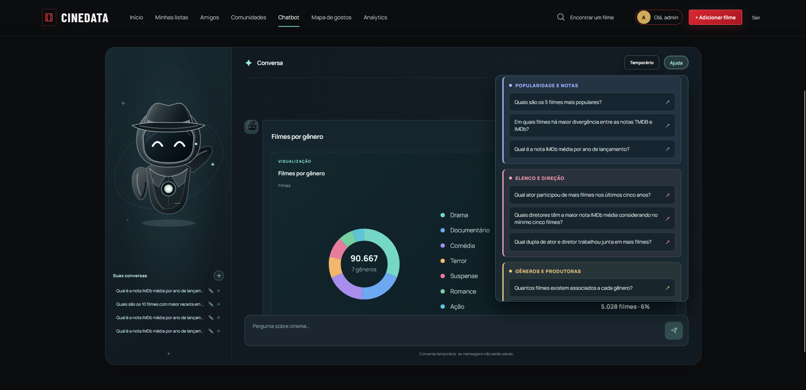

# CineData GenAI

Entrega da atividade de GenAI do Rocket Lab 2026.2. O projeto implementa um
agente analítico em Python que responde perguntas sobre filmes em linguagem
natural usando Gemini, tool calling e a camada Gold SQLite em modo somente
leitura. O CineData fornece a interface para enviar as consultas e visualizar
os resultados.

## Navegação rápida

| Guia | O que você encontra |
| --- | --- |
| [Assistente GenAI](#assistente-genai) | Fluxo da pergunta, componentes do agente e integração com o chatbot. |
| [Consultas obrigatórias](#cobertura-obrigatória-e-avaliações-locais) | Cobertura Q01–Q14, regras de métricas e avaliação contra referências. |
| [Extras da atividade](#extras-propostos-na-atividade) | Guardrails, gráficos, memória, fallback, cache, avaliação e busca híbrida. |
| [Bancos de dados](#bancos-de-dados) | Papel da Gold e do banco operacional, sincronização e cópia local do GenAI. |
| [Como executar](#como-executar-com-docker-compose) | Pré-requisitos, Docker Compose, Git LFS, chave Gemini e conta de demonstração. |
| [Configuração por ambiente](#configuração-por-ambiente) | Variáveis necessárias no Docker e opções para execução manual. |
| [Testes](#testes) | Comandos de avaliação, qualidade e testes automatizados. |
| [Documentação complementar](#documentação-complementar) | Regras de métricas, SQL de referência, casos Q01–Q14 e revisão da entrega. |

## Assistente GenAI

O chatbot é o núcleo desta entrega. Ele recebe uma pergunta em português,
identifica se ela pede uma métrica, um ranking, uma comparação ou filmes por
descrição e retorna a evidência correspondente.

O agente pede ao Gemini que gere SQL pela ferramenta `run_sql` nas perguntas
livres e em parte dos casos da avaliação. Algumas rotas frequentes ainda usam
SQL preparado para reduzir a latência. Perguntas descritivas podem procurar
termos em títulos e sinopses; se também pedirem uma métrica, os filmes
encontrados servem de recorte para uma consulta analítica.

A chave Gemini habilita as consultas de dados do chatbot. Casos reconhecidos
podem executar SQL preparado sem chamar o modelo a cada resposta. Nas perguntas
de divergência de notas, média IMDb por ano e filmes por gênero, o modelo gera
a consulta primeiro; uma consulta de referência confere o resultado e recupera
falhas. A interface informa quando a chave ainda não foi configurada.



O caminho analítico é composto por:

- `agent.py`: orquestra a pergunta, ferramenta, validação, consulta e resposta;
- `agent_models.py`: contratos dos tool calls e das respostas estruturadas;
- `gemini_adapter.py`: integração configurável com Gemini e fallback;
- `sql_guard.py` e `sql_executor.py`: validação e execução segura do SQL;
- `semantic_search.py`: busca por título e sinopse para perguntas descritivas ou híbridas;
- `insight_service.py`: interpreta resultados numéricos para a interface;
- `evaluation_runner.py`: avalia as perguntas de referência contra o Gold.

Para usar a entrega, abra o CineData em `http://localhost:8080` e entre na aba
**Chatbot**. O navegador chama `/genai/api/v1`; o Nginx encaminha essa rota ao
serviço GenAI internamente, sem expor a chave Gemini. A porta `8001` é apenas a
porta local do serviço para desenvolvimento, health check e diagnóstico. Há
também `POST /api/v1/questions/stream`, que entrega eventos de progresso e a
resposta final no mesmo fluxo. O backend operacional guarda o histórico de
contas autenticadas; o serviço GenAI recebe apenas o contexto resumido da
conversa corrente.

## Como uma consulta é respondida

Para perguntas analíticas, o agente responde somente com o que foi retornado
pela consulta. Quando faltar uma métrica, período ou filtro essencial, ele pede
o detalhe antes de executar SQL. As tabelas recebem nomes compreensíveis, sem
expor chaves técnicas como `sk_movie_id` ou `sk_person_id`.

Quando há dados comparáveis, a interface acrescenta o gráfico adequado e mantém
a tabela como detalhe consultável. Rankings financeiros usam barras, séries por
ano usam linhas, participações usam rosca e duas medidas de nota usam dispersão.
Os insights complementam os valores, sem inventar fatos fora deles.

Uma pergunta de continuação preserva o contexto analítico. Após “Qual produtora
acumulou o maior lucro total em BRL?”, “E em 2020?” mantém a métrica e aplica o
ano. Uma conversa nova começa sem essa referência. O modelo recebe somente até
três resumos da conversa atual; tokens e dados da conta não são enviados ao
provedor.

Antes de chegar ao banco, a consulta passa por guardrails e por `sqlglot`: só um
`SELECT` sobre tabelas e colunas autorizadas pode ser executado. O SQLite abre
em `mode=ro`, enquanto limites de linhas, timeout e joins complexos evitam
sobrecarga. Cache, fallback e avaliações locais mantêm a resposta rápida e
confiável.

## Arquitetura



| Camada | Tecnologias |
| --- | --- |
| Interface | React 19, TypeScript, Vite e CSS. |
| API | FastAPI, Pydantic, SQLAlchemy assíncrono e SQLite. |
| Dados | Gold SQLite, Git LFS, Alembic e sincronização transacional. |
| GenAI | FastAPI isolado, SDK Google GenAI, tool calling, `sqlglot` e SQLite read-only. |
| Qualidade | pytest, Ruff, Vitest, Testing Library, oxlint e Docker Compose. |

## Cobertura obrigatória e avaliações locais

O agente transforma perguntas em SQL e valida a consulta antes de executá-la.
Somente uma instrução `SELECT` nas tabelas e colunas autorizadas pode ser
executada. DDL, DML, múltiplas instruções e acesso a arquivos são rejeitados.
As respostas informam métrica, unidade, período, população válida e limitações.

| Caso | Pergunta que o agente cobre | Regra relevante |
| --- | --- | --- |
| Q01 | Quais são os 10 filmes com maior receita em BRL? | Considera receita informada e usa desempate estável. |
| Q02 | Qual é o lucro médio em BRL por gênero? | Lucro é receita menos orçamento; filme com vários gêneros participa uma vez em cada gênero. |
| Q03 | Quais filmes têm as maiores margens de lucro? | Margem é lucro dividido pela receita; receita precisa ser positiva. |
| Q04 | Quais são os 5 filmes mais populares? | Popularidade é uma pontuação do catálogo, não contagem de visualizações. |
| Q05 | Em quais filmes há maior divergência entre TMDB e IMDb? | Compara notas válidas e mostra também os votos para contextualizar a diferença. |
| Q06 | Qual é a nota IMDb média por ano de lançamento? | Média simples dos filmes lançados até a data atual, com nota e votos válidos, em ordem cronológica. |
| Q07 | Qual ator participou de mais filmes nos últimos cinco anos? | Conta filmes distintos na janela móvel de lançamento. |
| Q08 | Quais diretores têm a maior nota IMDb média? | Exige pelo menos cinco filmes com nota e votos válidos por diretor. |
| Q09 | Qual dupla de ator e diretor trabalhou junta em mais filmes? | Conta filmes em comum nos créditos disponíveis. |
| Q10 | Quantos filmes existem associados a cada gênero? | Conta cada filme uma vez dentro de cada gênero. |
| Q11 | Qual produtora acumulou o maior lucro total em BRL? | Soma o lucro integral dos filmes associados a cada produtora. |
| Q12 | Qual gênero tem a maior margem média de lucro? | Faz a média das margens dos filmes elegíveis, não a margem dos totais agregados. |
| Q13 | Quais filmes têm mais avaliações de usuários? | Usa a contagem resumida de avaliações por filme. |
| Q14 | Qual filme tem a maior divergência entre usuários e IMDb? | Compara a média dos usuários e a nota IMDb quando ambas têm votos válidos. |

Além das consultas estruturadas, a busca híbrida usa títulos e sinopses para
encontrar filmes por descrição e combina esse recorte com SQL quando necessário.

Os cenários de avaliação, resultados esperados e consultas de referência ficam
em [docs/genai/evaluation-cases.md](docs/genai/evaluation-cases.md) e
[docs/genai/reference-queries.sql](docs/genai/reference-queries.sql). Eles
validam os valores retornados e as colunas relevantes, não a forma textual do
SQL produzido pelo modelo.

Cada caso também registra métrica, unidade, período, população válida e
limitações. Isso evita, por exemplo, tratar uma pontuação de popularidade como
visualizações ou comparar notas sem informar quantos votos as sustentam. As
fórmulas e os filtros completos estão em
[regras de métricas](docs/genai/metric-rules.md).

## Caminhos demonstráveis no chatbot

| Objetivo | Pergunta para testar | Caminho esperado |
| --- | --- | --- |
| Ranking financeiro | `Quais são os 5 filmes com maior receita em BRL?` | SQL validado, tabela, gráfico e insight quando houver dados suficientes. |
| Continuação contextual | Pergunte `Qual produtora acumulou o maior lucro total em BRL?` e depois `E em 2020?` | Mantém a métrica por produtora e aplica o ano à conversa atual. |
| Busca híbrida | `Quais filmes têm histórias sobre viagem no tempo e qual teve maior receita?` | Busca sinopse, restringe candidatos e consulta os valores. |
| Comparação de notas | `Em quais filmes há maior divergência entre TMDB e IMDb?` | Compara as duas notas, apresenta tabela e gráfico de dispersão. |
| Participação por gênero | `Quantos filmes existem associados a cada gênero?` | Conta os filmes por gênero e apresenta gráfico de rosca com insights. |

## Extras propostos na atividade

O enunciado sugere ampliar o agente com as capacidades abaixo. Elas foram
integradas ao chatbot e podem ser demonstradas na própria interface.

### Guardrails

O serviço verifica a pergunta antes de consultar o modelo e recusa pedidos fora
do escopo do CineData, SQL enviado diretamente e tentativas de alterar as
instruções do agente. Se houver uma consulta analítica, outra camada valida o
SQL gerado:
permite um único `SELECT` nas tabelas autorizadas, limita resultados e bloqueia
escrita, acesso a arquivos e consultas excessivamente custosas. O SQLite é
aberto somente para leitura, mesmo depois da validação.

As proteções são aplicadas em camadas independentes. Assim, uma falha em uma
etapa não concede ao modelo acesso direto ao banco:

| Camada | Aplicação concreta |
| --- | --- |
| Contrato HTTP | Aceita pergunta não vazia de até 1.000 caracteres e no máximo três resumos de contexto. |
| Filtro de entrada | Normaliza maiúsculas e acentos e bloqueia prompt injection, revelação de instruções, SQL explícito e pedidos para consultar URLs, internet ou fontes externas. |
| Ferramenta do modelo | O Gemini recebe somente a ferramenta `run_sql`; ele não recebe uma conexão SQLite nem credenciais do banco. As perguntas de divergência de notas, média IMDb por ano e filmes por gênero são geradas pelo modelo e conferidas contra consultas de referência. Outras rotas reconhecidas podem usar SQL preparado. |
| Validador SQL | `sqlglot` aceita uma única instrução `SELECT` ou `UNION`, com até 16.000 caracteres, oito CTEs, oito `JOINs`, doze subconsultas e 100 linhas. CTE recursiva, `CROSS JOIN`, outro banco, tabelas fora do contrato e funções como `load_extension`, `readfile`, `writefile`, `randomblob` e `zeroblob` são rejeitados. |
| Executor SQLite | Abre o arquivo com `mode=ro`, limita a duração da consulta e usa o autorizador nativo do SQLite para negar `INSERT`, `UPDATE`, `DELETE`, `DROP`, `ATTACH`, `DETACH`, `PRAGMA` e leitura de tabelas que não pertencem à Gold. |

O limite padrão é de cinco segundos; consultas obrigatórias reconhecidamente
mais pesadas recebem limites específicos de quinze ou quarenta e cinco segundos.
O executor busca no máximo 101 linhas para sinalizar truncamento e devolve no
máximo 100 ao chatbot. Uma rejeição retorna uma mensagem controlada, sem expor
o SQL gerado, a estrutura interna ou detalhes da chave Gemini.

### Interface visual

O agente funciona dentro do chatbot do CineData. A pessoa envia perguntas em
português e recebe texto, tabelas com nomes de colunas compreensíveis, avisos de
esclarecimento e mensagens de erro. O botão **Ajuda** oferece perguntas prontas,
inclusive as 14 consultas obrigatórias, organizadas por tema e sem mostrar SQL
ou identificadores internos.

### Capturas da interface

Evolução da nota média do IMDb. Em respostas com dados, o botão **Baixar CSV**
exporta todas as linhas retornadas junto do contexto da análise. Quando a resposta
tem gráfico, **Baixar PNG** gera uma imagem da visualização com título, métrica,
unidade, período e recorte aplicados:



Distribuição dos filmes por gênero, com insights gerados a partir dos resultados:



Painel Ajuda, que reúne as consultas obrigatórias organizadas por tema:



### Gráficos

Resultados que permitem comparação ganham uma visualização gerada a partir das
mesmas linhas da tabela: barras para rankings, linha para evolução no tempo,
rosca para participações e dispersão para comparar duas notas. A tabela continua
disponível para conferir os valores. Um serviço separado recebe os dados já
consultados e escreve até três insights; ele não executa novas consultas.

### Memória de conversa

Até três resumos da conversa atual ajudam a interpretar perguntas de
continuação. Em “E em 2020?”, por exemplo, o agente mantém a métrica anterior e
altera o período. Uma nova conversa começa sem esse contexto; o histórico salvo
de cada conta e o modo temporário são extensões dessa experiência.

### Fallback entre modelos

Em falhas transitórias do provedor, como timeout, indisponibilidade ou cota, o
adaptador pode tentar uma vez um modelo alternativo configurado com a mesma
chave. Erros de pergunta, SQL ou banco não acionam essa troca. O modelo que
respondeu fica registrado nos logs do serviço, sem expor a chave ao navegador.

O roteador classifica localmente cada pergunta como simples, analítica, híbrida
ou complexa, sem nova chamada de IA. Perguntas híbridas, longas, comparativas
ou com contexto podem usar o modelo configurado para maior capacidade; as demais
usam o modelo leve. As quatro perguntas canônicas com conferência automática
de resultado usam o modelo leve mesmo quando mencionam uma série anual.
A tentativa alternativa ocorre somente para falhas de rede,
timeout ou respostas 408, 429 e 5xx. Ela não é uma segunda tentativa para
"melhorar" uma resposta nem relaxa guardrails, validação SQL ou limites.

### Cache de respostas

Perguntas livres equivalentes podem ser reutilizadas por cinco minutos na memória
do serviço. As 14 perguntas completas da Ajuda compartilham a resposta pública
por até uma hora entre conversas, inclusive os insights; a primeira execução
ainda gera SQL pelo modelo nos casos que usam essa rota. A chave do cache
considera a pergunta, a revisão do banco analítico e a versão das regras.
Perguntas livres também consideram a conversa e o contexto, para que uma
continuação diferente não receba uma resposta antiga. O cache desaparece
quando o serviço reinicia.

Na prática, a chave é um hash SHA-256 da pergunta normalizada, identificador da
conversa (ou do caso fixo), até três resumos semânticos, tamanho e data de
modificação da Gold e versão das regras. O serviço mantém até 100 respostas
bem-sucedidas em memória;
o texto da pergunta não é usado como identificador em claro. Não há cache
persistente nem compartilhado depois de reiniciar o contêiner.

### Avaliação

Além de comparar as 14 consultas obrigatórias com resultados de referência,
os cenários locais cobrem variações de linguagem, filtros, empates, ausência de
dados e ambiguidades. Modelos simulados permitem
verificar regras, valores e formato das respostas sem gastar cota Gemini. Essa
avaliação detecta regressões conhecidas; perguntas livres ainda dependem do
comportamento do modelo e dos dados disponíveis.

O avaliador compara colunas e valores devolvidos, não exige que o SQL do modelo
seja textualmente igual ao SQL de referência. Isso permite testar o contrato da
resposta, incluindo métrica, unidade, período, população e limitações, mesmo
quando a consulta válida tiver uma redação diferente. Os testes locais também
cobrem guardrails, timeout, streaming, cache, fallback, continuação de conversa
e falhas controladas da Gold.

### Agente híbrido: busca em sinopses e SQL

Perguntas descritivas procuram filmes em títulos e sinopses por similaridade
textual calculada localmente, sem serviço externo de embeddings. Se a mesma
pergunta pedir um número, os filmes encontrados orientam uma consulta SQL
validada no banco analítico. Por exemplo, “Quais filmes falam de viagem no tempo
e qual teve maior receita?” combina a seleção por descrição com a comparação de
receitas, mantendo a origem dos dados identificada na resposta.

O índice é construído a partir de títulos e sinopses disponíveis na Gold e
reconstruído somente quando tamanho ou data de modificação do arquivo mudam. A
busca remove palavras de formulação como “qual”, “maior” e “receita”, mede a
similaridade por termos e ordena candidatos por pontuação e título. Quando a
pergunta também pede receita, o serviço classifica todos os candidatos
encontrados com uma consulta local determinística; o modelo não escolhe uma
amostra diferente a cada resposta.

### Progresso, privacidade e respostas estruturadas

A interface usa `POST /api/v1/questions/stream`, que envia eventos NDJSON de
entendimento, busca, preparação e resultado. Os eventos descrevem etapas
visíveis da operação, sem expor raciocínio interno do modelo ou SQL. Cabeçalhos
de não cache e não buffering mantêm o progresso legível mesmo atrás do proxy.

O navegador acessa o serviço pelo proxy `/genai/api/v1`; a chave Gemini fica
somente no ambiente do contêiner. Para continuidade, o GenAI recebe até três
resumos da conversa atual, e não o histórico persistente completo da conta. A
resposta final possui contrato estruturado com texto, linhas, colunas,
metadados da métrica, origem, indicação de cache, truncamento e quantidade de
tool calls. Gráficos e insights consomem essas mesmas linhas já validadas; o
serviço de insights não tem acesso à Gold e não executa SQL.

### Ampliações próprias do CineData

Além desses extras, o projeto inclui histórico privado com conversas salvas e
modo temporário; exportação de tabelas em CSV e gráficos em PNG; progresso
durante o processamento; e roteamento entre modelos conforme a complexidade da
pergunta. Essas capacidades complementam os extras acima, mas não são requisitos
extras separados do enunciado.

## Bancos de dados

`data/cinerocket.db` é a fonte Gold analítica distribuída por Git LFS e montada
somente para leitura. Em uma instalação nova com o snapshot Gold distribuído
neste repositório, a preparação copia o arquivo de uma vez, verifica seu
SHA-256 e adapta a tabela de avaliações; o backend aplica as migrações sem
reimportar o catálogo linha a linha. `data/rocketlab.db` preserva contas,
listas, avaliações, comunidades e conversas. Inicializações seguintes
reutilizam esse banco e o fingerprint evita sincronizações desnecessárias.

| Banco | Papel |
| --- | --- |
| `data/cinerocket.db` | Fonte Gold para analytics e GenAI. |
| `data/rocketlab.db` | Banco operacional local do CineData. |
| Volume `genai-gold` | Cópia local para acelerar o serviço GenAI. |

## Estrutura relevante para a entrega

```text
genai/
  app/
    agent.py               Orquestrador da pergunta analítica
    agent_models.py        Contratos de tool calling e resposta
    gemini_adapter.py      Gemini e fallback de modelo
    question_guard.py      Guardrails de pergunta
    sql_guard.py           Validação de SQL permitido
    sql_executor.py        Execução SQLite somente leitura
    semantic_search.py     Busca híbrida por título e sinopse
    insight_service.py     Insights para resultados numéricos
    evaluation_runner.py   Avaliações locais Q01-Q14
  tests/                   Testes do módulo GenAI
docs/genai/                Schema, regras e SQL de referência
frontend/src/components/   Chatbot, tabelas, gráficos e apresentação
backend/app/conversations/ Histórico privado e modo temporário
data/cinerocket.db         Gold SQLite, obtido por Git LFS
docker-compose.yml         Serviços frontend, backend e GenAI
```

## Como executar com Docker Compose

### Pré-requisitos

- Docker Desktop com Docker Compose v2;
- Git e Git LFS somente para clonar e obter o arquivo Gold;
- chave Gemini para todas as consultas de dados no chatbot.

O Git LFS é necessário uma única vez porque o banco Gold tem cerca de 722 MB e
é montado pelo host como arquivo somente leitura. Depois do clone, baixe o
banco antes de iniciar o Compose:

```powershell
git lfs install
git clone https://github.com/GuilhermeRangel1/CineData-GenAi.git
cd CineData-GenAi
git lfs pull
```

O download precisa ocorrer fora do contêiner porque a imagem não recebe a
pasta `.git` nem as credenciais Git da pessoa que clonou o repositório.

O Compose usa `pull_policy: build`, construindo as imagens locais antes da
subida. Ele prepara o banco operacional, aplica as migrações e inicia o GenAI
automaticamente. Na primeira execução, a cópia e a construção dos índices
ainda podem levar alguns minutos conforme o disco e a máquina. Para executar
em segundo plano:

```powershell
docker compose up -d
```

Quando os serviços estiverem saudáveis, abra **http://localhost:8080** e use a
aba **Chatbot** para realizar as consultas da entrega. Essa é a única porta que
uma pessoa avaliando o projeto precisa acessar.

Endereços disponíveis:

- **CineData e chatbot:** http://localhost:8080
- **API do CineData:** http://localhost:8000
- **Documentação técnica da API:** http://localhost:8000/docs
- **Saúde do serviço GenAI:** http://localhost:8001/health

Conta de demonstração local:

```text
E-mail: admin@admin.com
Senha: admin123
```

Essas credenciais são apenas para desenvolvimento local. Antes de expor o
projeto a uma rede, troque `JWT_SECRET_KEY` e as credenciais iniciais.

Para encerrar mantendo os dados, use `Ctrl+C` ou `docker compose down`. Para
recomeçar o banco operacional, remova `data/rocketlab.db`; não remova o Gold.

### Modelos Gemini

Não é preciso criar `genai/.env` para iniciar o CineData. Sem chave, o chatbot
mostra um aviso de configuração, mantém a orientação sobre o uso do site e
bloqueia todas as consultas a dados de filmes. Isso inclui as perguntas da
Ajuda que possuem SQL preparado: a execução local continua rápida e estável,
mas só fica disponível depois da configuração da chave.

Para habilitar consultas analíticas, copie o arquivo de exemplo e preencha
somente a chave:

```powershell
Copy-Item genai/.env.example genai/.env
```

Os demais valores do `genai/.env` já têm padrão. A mesma chave atende ao modelo
leve, ao modelo para perguntas complexas e ao fallback:

```dotenv
GENAI_GEMINI_API_KEY=sua_chave
GENAI_GEMINI_MODEL=gemini-3.5-flash-lite
GENAI_GEMINI_COMPLEX_MODEL=gemini-3.5-flash
GENAI_GEMINI_FALLBACK_MODEL=gemini-3.5-flash
```

Se o Compose já estiver em execução, recrie o serviço após editar `genai/.env`
e atualize a página:

```powershell
docker compose up -d --force-recreate genai
```

Sem a chave, as demais áreas do CineData continuam disponíveis; pedidos de
dados enviados diretamente à API retornam `provider_not_configured`.

## Execução sem Docker

É necessário Python 3.11+ e Node.js compatível com Vite. Primeiro, execute
`git lfs pull`.

```powershell
# Backend
Copy-Item backend/.env.example backend/.env
Set-Location backend
py -3.11 -m venv .venv
.\.venv\Scripts\python -m pip install -e ".[dev]"
.\.venv\Scripts\alembic upgrade head
.\.venv\Scripts\python -m app.db.gold_seed --database-url "sqlite+aiosqlite:///./rocketlab.db"
.\.venv\Scripts\uvicorn app.main:app --reload
```

```powershell
# GenAI, em outro terminal
Copy-Item genai/.env.example genai/.env
Set-Location genai
python -m pip install -e ".[dev]"
python -m uvicorn app.main:app --reload --port 8001
```

```powershell
# Frontend, em outro terminal
Copy-Item frontend/.env.example frontend/.env
Set-Location frontend
npm ci
npm run dev
```

O frontend de desenvolvimento abre em `http://localhost:5173` e usa o proxy do
Vite para encaminhar o GenAI local.

## Configuração por ambiente

Para executar a demonstração com Docker Compose, o único valor que a pessoa
precisa fornecer para usar o chatbot analítico é `GENAI_GEMINI_API_KEY` em
`genai/.env`. O Compose já define banco, rotas, conta de
demonstração e endereços do frontend; não é necessário criar `backend/.env` nem
`frontend/.env` nesse fluxo.

| Variável | Quando configurar |
| --- | --- |
| `GENAI_GEMINI_API_KEY` | Necessária para todas as consultas de dados do chatbot, mesmo as preparadas. |
| `GENAI_GEMINI_MODEL`, `GENAI_GEMINI_COMPLEX_MODEL`, `GENAI_GEMINI_FALLBACK_MODEL` | Opcional. Use somente para trocar os modelos padrão. |
| `TMDB_API_TOKEN` | Opcional. Habilita a busca administrativa no TMDB. |
| `JWT_SECRET_KEY`, `INITIAL_ADMIN_*` | Somente ao mudar a configuração local padrão ou publicar o projeto. |
| `DATABASE_URL`, `GOLD_DATABASE_PATH`, `VITE_API_BASE_URL`, `VITE_GENAI_API_BASE_URL` | Somente na execução manual, fora do Docker Compose. |

## Testes

Os testes do agente usam clientes simulados e não consomem cota Gemini. As
consultas Q01–Q14 também podem ser comparadas com o banco configurado no
Compose, usando SQL de referência como modelo simulado:

```powershell
docker compose run --rm --no-deps -v "${PWD}:/project:ro" -e PYTHONPATH=/project/genai --entrypoint sh genai -c "cd /project && python genai/scripts/evaluate_agent_snapshot.py"
```

Para executar as suítes de desenvolvimento sem Docker, a partir da raiz:

```powershell
Push-Location backend
.\.venv\Scripts\python -m pytest
.\.venv\Scripts\ruff check .
Pop-Location
```

```powershell
Push-Location genai
python -m pytest
python -m ruff check .
Pop-Location
```

```powershell
Push-Location frontend
npm ci
npm run test
npm run lint
npm run build
Pop-Location
```

## Documentação complementar

- [Plano de execução](docs/.ruler/TODO.md)
- [Banco de dados e sincronização Gold](docs/database.md)
- [Guia de backend](docs/backend.md)
- [Interface](docs/frontend.md)
- [Esquema permitido pelo agente](docs/genai/gold-schema.md)
- [Regras de métricas](docs/genai/metric-rules.md)
- [Consultas SQL de referência](docs/genai/reference-queries.sql)
- [Casos de avaliação Q01–Q14](docs/genai/evaluation-cases.md)
- [Revisão final da entrega GenAI](docs/genai/review-final.md)
- [Detalhes do módulo GenAI](genai/README.md)

## Limitações conhecidas

- SQLite e execução local atendem à demonstração; produção concorrente exige
  banco servidor e infraestrutura dedicada.
- A qualidade das respostas analíticas depende do Gemini e dos dados Gold.
- A busca por sinopses usa similaridade de termos, que pode não encontrar uma
  ideia quando ela não aparece nos títulos ou textos disponíveis.
- A avaliação local confirma os casos de referência; perguntas livres ainda
  dependem do SQL produzido pelo modelo configurado.
- O cache de respostas é temporário e fica na memória do serviço GenAI.
- O mapa de gostos usa o catálogo local e não recomenda filmes fora da base.
- Imagens, trailers e TMDB dependem dos serviços de origem e da conexão.
